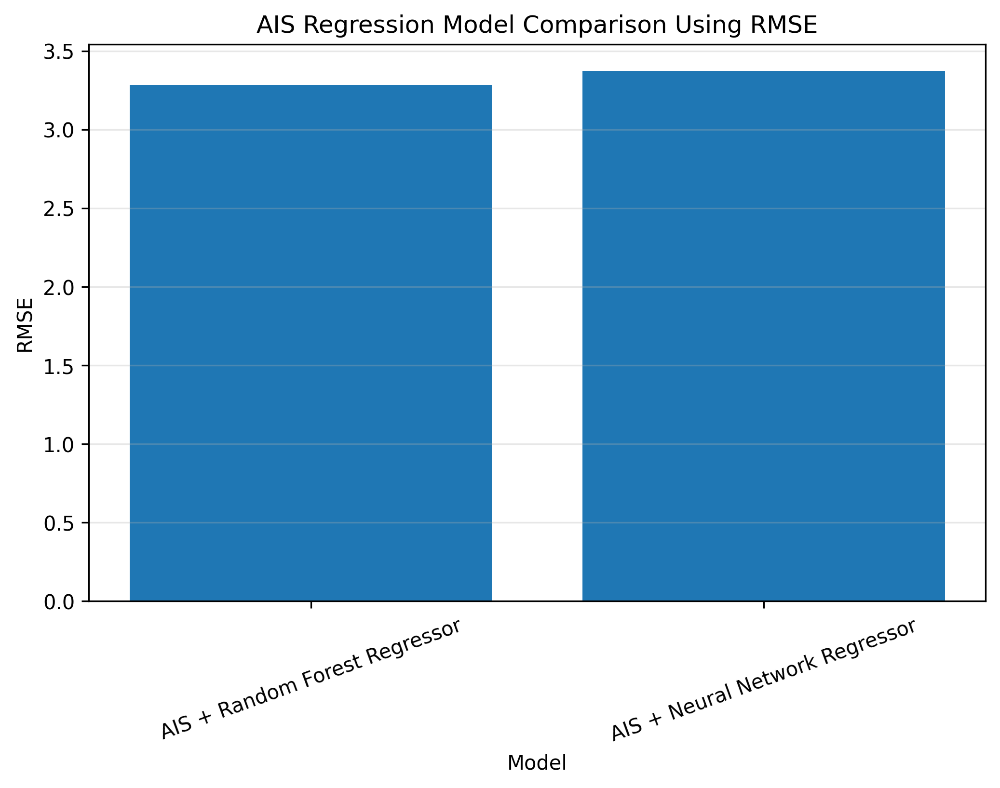

# 🌧️ CSA Smart Rainfall Forecasting & Drought Early Warning System

## 🧠 Rainfall Prediction and Drought Risk Analysis using Crow Search Algorithm (CSA) and Machine Learning

---

## 👤 Author

**Sagnik Patra**

---

## 📌 Project Overview

This project develops an intelligent **Rainfall Forecasting and Drought Early Warning System** using the **Crow Search Algorithm (CSA)** for feature selection and machine learning models for rainfall prediction and drought classification.

The system analyzes historical rainfall data from the Beed district, extracts meaningful temporal and rainfall-related features, applies CSA-based optimization to identify the most relevant predictors, and trains predictive models to forecast future rainfall and classify drought risk levels.

The framework combines:

- Crow Search Algorithm (CSA)
- Random Forest Regression
- Random Forest Classification
- Deep Neural Networks
- Feature Engineering
- Drought Risk Assessment
- Predictive Analytics
- Visualization and Reporting

The project automatically generates trained models, configuration files, prediction outputs, evaluation reports, visualizations, and optimized feature-selection results.

---

# 📊 Model Comparison



---

## 🎯 Objectives

### Rainfall Forecasting

- Predict next-day rainfall values
- Analyze rainfall trends
- Detect rainfall fluctuations
- Improve prediction performance using CSA-based feature selection

### Drought Early Warning

- Classify drought severity levels
- Identify high-risk drought periods
- Support environmental monitoring and planning

### Feature Optimization

- Reduce redundant features
- Improve model efficiency
- Enhance prediction accuracy

---

# 📂 Dataset Information

### Dataset

**Daily_Rainfall_District_Beed.csv**

### Attributes

- District
- Date
- Daily Rainfall (m.m)
- Progressive Rainfall (m.m)

### Derived Features

- Day
- Month
- Year
- Day Of Week
- Week Of Year
- Rainfall Lag Features
- Rolling Rainfall Averages
- Progressive Rainfall Growth
- Rainfall Indicators

---

# ⚙️ Project Workflow

---

## Phase 1: Data Preprocessing

### Data Cleaning

- Load rainfall dataset
- Handle missing values
- Convert date columns
- Remove invalid records

### Data Transformation

- Convert rainfall values into numerical format
- Sort observations chronologically
- Normalize features using StandardScaler

---

## Phase 2: Feature Engineering

### Temporal Features

- Day
- Month
- Year
- DayOfWeek
- WeekOfYear

### Rainfall Features

- Rainfall_Lag_1
- Rainfall_Lag_2
- Rainfall_Lag_3

### Rolling Statistics

- Rolling_3_Day_Avg
- Rolling_7_Day_Avg

### Growth Metrics

- Progressive_Growth
- Rainy_Day Indicator

---

## Phase 3: CSA Feature Selection

### Crow Search Algorithm

CSA is a population-based optimization algorithm inspired by the intelligent behavior of crows hiding and retrieving food.

### CSA Process

1. Initialize crow population
2. Generate memory positions
3. Evaluate fitness
4. Update positions
5. Select best solutions
6. Identify optimal feature subset

### Benefits

- Removes irrelevant features
- Improves generalization
- Reduces model complexity
- Enhances prediction performance

---

## Phase 4: Machine Learning Models

### 1. CSA + Random Forest Regressor

Used for:

- Rainfall Prediction

Evaluation:

- MAE
- RMSE
- R² Score

---

### 2. CSA + Neural Network Regressor

Architecture:

- Dense Layer (64)
- Dropout
- Dense Layer (32)
- Dropout
- Dense Layer (16)
- Output Layer

Used for:

- Rainfall Prediction

Evaluation:

- MAE
- RMSE
- R² Score

---

### 3. CSA + Random Forest Classifier

Used for:

- Drought Risk Classification

Evaluation:

- Accuracy
- Precision
- Recall
- F1 Score
- Confusion Matrix

---

# 🌍 Drought Risk Categories

| Daily Rainfall | Risk Level |
|---------------|------------|
| < 2 mm | High Drought Risk |
| 2 – 10 mm | Medium Drought Risk |
| > 10 mm | Low Drought Risk |

---

# 📈 Generated Outputs

## Trained Models

### Deep Learning Model

```text
csa_rainfall_neural_network_model.h5
```

### Random Forest Models

```text
csa_rainfall_random_forest_regressor.pkl
csa_drought_risk_random_forest_classifier.pkl
```

### Supporting Files

```text
csa_rainfall_scaler.pkl
csa_rainfall_label_encoders.pkl
```

---

# 📊 Generated CSV Files

### Model Results

```text
csa_model_results.csv
```

Contains:

- Accuracy
- RMSE
- MAE
- R² Score

### Predictions

```text
csa_predictions.csv
```

Contains:

- Actual Rainfall
- Predicted Rainfall
- Actual Drought Risk
- Predicted Drought Risk

### Feature Selection

```text
csa_feature_selection.csv
```

Contains:

- Selected Features
- Rejected Features

---

# 📄 Generated Configuration Files

### JSON

```text
csa_results.json
```

Contains:

- Metrics
- Selected Features
- Model Statistics

### YAML

```text
csa_config.yaml
```

Contains:

- Project Configuration
- Dataset Information
- Output Details

---

# 📉 Generated Visualizations

### Model Performance

```text
csa_accuracy_graph.png
```

### Confusion Matrix

```text
csa_confusion_matrix_heatmap.png
```

### Model Comparison

```text
csa_comparison_graph.png
```

### Result Analysis

```text
csa_result_graph.png
```

### Rainfall Prediction Graph

```text
csa_prediction_graph.png
```

### CSA Optimization Curve

```text
csa_fitness_curve.png
```

### Feature Selection Graph

```text
csa_feature_selection_graph.png
```

### Rainfall Trend Analysis

```text
csa_rainfall_trend_graph.png
```

### Monthly Rainfall Analysis

```text
csa_monthly_rainfall_graph.png
```

### Correlation Analysis

```text
csa_correlation_heatmap.png
```

---

# 📐 Evaluation Metrics

## Regression Metrics

### MAE

Mean Absolute Error

### RMSE

Root Mean Squared Error

### R² Score

Coefficient of Determination

---

## Classification Metrics

### Accuracy

Overall prediction correctness

### Precision

Positive prediction quality

### Recall

Detection capability

### F1 Score

Balanced performance metric

---

# 🏗️ Project Structure

```text
CSA Smart Rainfall Forecasting & Drought Early Warning System
│
├── Daily_Rainfall_District_Beed.csv
│
├── csa_rainfall_neural_network_model.h5
├── csa_rainfall_random_forest_regressor.pkl
├── csa_drought_risk_random_forest_classifier.pkl
├── csa_rainfall_scaler.pkl
├── csa_rainfall_label_encoders.pkl
│
├── csa_feature_selection.csv
├── csa_model_results.csv
├── csa_predictions.csv
│
├── csa_results.json
├── csa_config.yaml
│
├── csa_accuracy_graph.png
├── csa_confusion_matrix_heatmap.png
├── csa_comparison_graph.png
├── csa_result_graph.png
├── csa_prediction_graph.png
├── csa_fitness_curve.png
├── csa_feature_selection_graph.png
├── csa_rainfall_trend_graph.png
├── csa_monthly_rainfall_graph.png
├── csa_correlation_heatmap.png
│
└── README.md
```

---

# 🚀 Technologies Used

- Python
- Pandas
- NumPy
- Matplotlib
- Scikit-Learn
- TensorFlow / Keras
- Crow Search Algorithm (CSA)
- Random Forest
- Deep Neural Networks
- YAML
- JSON

---

# 🔮 Future Enhancements

- Real-time rainfall forecasting
- IoT weather sensor integration
- Mobile drought alert system
- GIS-based rainfall visualization
- Satellite weather data integration
- Multi-district forecasting
- Seasonal drought prediction

---

# 🏆 Conclusion

The **CSA Smart Rainfall Forecasting & Drought Early Warning System** demonstrates how nature-inspired optimization algorithms and machine learning can be combined to improve rainfall forecasting and drought risk assessment.

By leveraging the **Crow Search Algorithm** for feature optimization and advanced predictive models for forecasting, the system provides an efficient framework for environmental monitoring, water resource planning, and drought preparedness.

---
**Author:** Sagnik Patra  
**Project Type:** Machine Learning + Optimization + Environmental Analytics  
**Algorithm:** Crow Search Algorithm (CSA)
